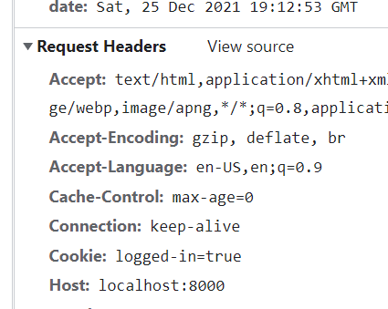

# Cookies

An HTTP server that handles authentication built using Deno. The goal here was to learn about how the "platform" handles authentication (i.e. just HTML and HTTP)!

## Running the Server

1. Install [Deno](https://deno.land/#installation)
2. Start the server with the following command:

```
deno --allow-net --allow-read server.ts
```

3. Open up your browser and navigate to `localhost:8000`
4. In the username and password form, type in `hello` as the username and `world` as the password
5. You should be redirected to the welcome page, and if you look in the network tab, you should see a new cookie was sent in the request

## Why Deno?

I knew I needed to write my own HTTP server for this but I _also_ knew I wanted to:

1. Use Typescript
2. Use as few dependencies as possible
3. Use the fetch API's interfaces if possible

It just so happens that Deno's HTTP standard library ticks all of these boxes out of the box (also a good excuse to try out Deno for the first time!).

## How does it work?

Authentication using HTTP revolves around cookies. When the user logs in using the form, the server tells the browser to store a cookie that says the user is logged in. In later requests, the server uses this cookie to determine if the user is logged in or not.

### Cookies

A cookie is a piece of data that the browser stores and sends with each HTTP request. It looks like this:

```
logged-in=true; expires=Sat, 01 Jan 2022 00:00:00 GMT; HttpOnly;
```

A server lets the browser know to store a cookie using the `Set-Cookie` header in its response:

```ts
return new Response(/* some body */, {
  /* other headers */
  "Set-Cookie": "logged-in=true; HttpOnly",
})
```

After doing this, the browser will automatically send the cookie as part of its headers in subsequent requests:



The server can now parse this cookie to determine if the user is logged in or not (in this case, the logged in check is merely checking if the cookie exists).

### Logging In

Since the goal here is to not use JS whatsoever in the front-end, we have to send the login credentials using pure HTML. Thankfully this is pretty straightforward because the default `form` element already has this feature built in.

By default, when you submit a form, the browser will make a GET request to the current URL with the form's input values as query parameters. So if you have the following form in the `/login` path:

```html
<form>
  <label>
    Username
    <input type="text" name="username" placeholder="Username" />
  </label>
  <label>
    Password
    <input type="password" name="password" placeholder="Password" />
  </label>
  <button type="submit">Log in</button>
</form>
```

And you type in `hello` as the username and `world` as the password, the browser will redirect you to `/login?username=hello&password=world`. In some cases like a search bar, a GET request makes sense because you're looking to _get_ more data.

But in the case of login like we have here, it makes more sense to send the username and password as a POST request instead since we're trying to "create" a new login session.

To do this, we only need to add the `method="post"` attribute to the form:

```html
<form method="post">
  <label>
    Username
    <input type="text" name="username" placeholder="Username" />
  </label>
  <label>
    Password
    <input type="password" name="password" placeholder="Password" />
  </label>
  <button type="submit">Log in</button>
</form>
```

Now when we submit the form, the browser will instead send a POST request to the current url with the input values as the request _body_. This request will have the `application/x-www-form-urlencoded` content type.

Let's go back to the server to handle this form submission request.

The nice thing about sending it this way is that the fetch API's `Request` interface has methods specifically for handling this type of request. To get the form data, we only need to call the `.formData()` method of the request:

```ts
/**
 * Handler for authentication. Checks if the username and password matches
 * and if it does, redirects to the home page and sets the logged in cookie.
 */
if (req.method === "POST" && path === "/login") {
  const formData = await req.formData();
  const username = formData.get("username");
  const password = formData.get("password");

  // TODO: Check credentials and set cookie
}
```

Next, we check if the credentials match what we have on file and if it does, redirect the user to the home page, making sure to set the logged in cookie:

```ts
if (req.method === "POST" && path === "/login") {
  const formData = await req.formData();
  const username = formData.get("username");
  const password = formData.get("password");

  if (username === USERNAME && password === PASSWORD) {
    /**
     * We tell the browser to redirect using a 3xx response code. The browser 
     * will look at the "Location" header to determine where to redirect to.
     */ 
    return new Response(null, {
      status: 302,
      headers: {
        Location: "../home",
        /**
         * Tell the browser to save a new cookie. We use this cookie to check 
         * if the user is logged in when visiting the home page.
         */ 
        "Set-Cookie": "logged-in=true",
      }
    })
  }
}
```

Otherwise, we respond saying the credentials were incorrect:

```ts
if (req.method === "POST" && path === "/login") {
  const formData = await req.formData();
  const username = formData.get("username");
  const password = formData.get("password");

  if (username === USERNAME && password === PASSWORD) {
    /**
     * We tell the browser to redirect using a 3xx response code. The browser 
     * will look at the "Location" header to determine where to redirect to.
     */ 
    return new Response(null, {
      status: 302,
      headers: {
        Location: "../home",
        /**
         * Tell the browser to save a new cookie. We use this cookie to check 
         * if the user is logged in when visiting the home page.
         */ 
        "Set-Cookie": "logged-in=true",
      }
    })
  } else {
    return new Reponse("Username or password was incorrect", {
      status: 401
    })
  }
}
```
